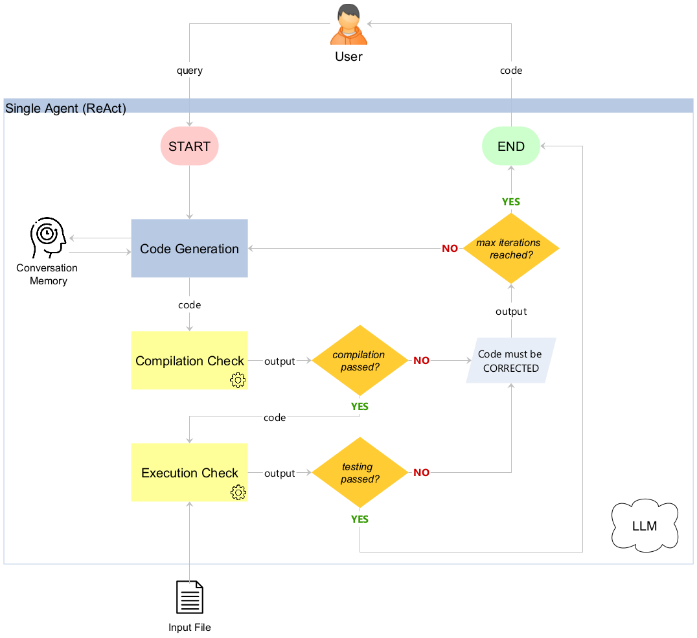
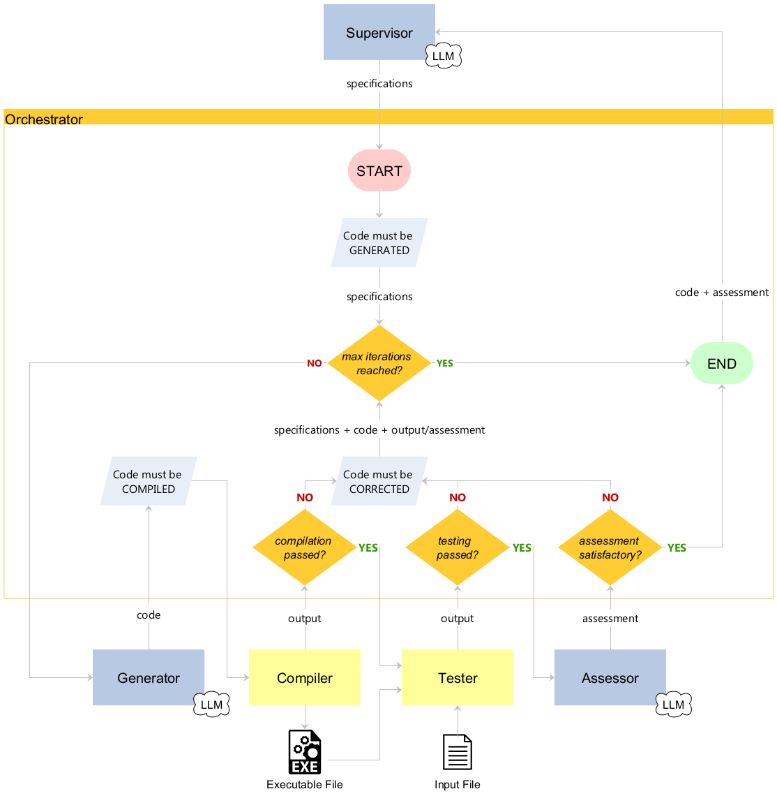

# Setup

## Virtual environment

- **Python**: 3.13.9
- **Packages**: `requirements.txt`
- **Variables**: `.env`
    ```
    WSL="your-wsl-if-used"
    GOOGLE_API_KEY="your-key"
    OPENAI_API_KEY="your-key"
    ANTHROPIC_API_KEY="your-key"
    ```
    **NB**: if you don't need WSL because you are already running on Linux OS, don't leave empty that variable but set it equal to "none".

## WSL

- Ubuntu 24.04.3 LTS
```
wsl --install -d Ubuntu
```

### GCC

- gcc (Ubuntu 13.3.0-6ubuntu2~24.04) 13.3.0
```
wsl -d Ubuntu sudo apt install -y build-essential gcc g++
```

# How to run (on Windows)

**First**, move to project folder and activate the virtual environment built on `requirements.txt`:
```
.venv\Scripts\activate
```

## Single-agent
```
python zero_shot_agent.py
```

## Multi-agent
```
python multi_agent.py
```

## Benchmark
**NB**: check first the settings inside the file `benchmark.py`
```
python benchmark.py
# when the above is finished 
python benchmark_edit.py
```

## Benchmark statistics
**NB**: check first the flags at the top and the input directory inside the file
```
python benchmark_group.py
```

# Nothes

## Done

- general code refactoring
    - agents prompts isolated from the logic
    - redundant message passing bugfix on multiagent
- supervisor memory avoided but last code assessment kept in agent state (not read from log)
- not using ReAct for multiagent
    - supervisor and assessor doesn't need ReAct since they don't have tools to use (so they do a single LLM call)
    - also generator doesn't need ReAct at all because in a multiagent system each agent can do 1 thing
    - "Agent stopped due to iteration limit or time limit" problem solved without ReAct
- let the user choose directly the followings:
    - file format to generate the parser for (PDF, JSON, HTML, etc...)
        - so test can be easily executed
    - the first part of the interaction: GENERATE_PARSER, CORRECT_ERROR, ASSESS_CODE, GENERAL_CONVERSATION
        - LLM didn't always understand it by itself
- orchestrator, compiler and tester nodes introduced
- compiler-assisted diagnostics and static analysis (light)
    - vulnerability assessment but only at build-time
- dynamic analysis
    - vulnerability assessment at run-time
    - new profile with sanitizers: created by compiler, launched by tester
- testing, simple strategy:
    - if testing OK: print a summary of parsed input on stdout
    - if testing FAILS: print errors on stderr

### Minors

- output folders divided by file format
- user can generate 1 file format parser for each conversation (avoiding confusion)
- better stderr management with file name replaced (confounding) and line and column number specified
- better context management between different loops in multiagent system (keeping in memory last parser generated) and avoiding passing entire conversation history (confounding)

## Experimental Benchmarking

- Single ReAct agent vs Multi agent (2)
- for all file formats (6)
- for all LLM (3)
- metrics:
    - mean parser compilation/testing/validation TIME
        - inside 1 round
    - mean parser compilation/testing/validation ITERATIONS
        - ReAct loops for Single, Graph iterations for Multi
        - inside 1 round, from 1 to max_iterations
    - compilation/testing/validation rate
        - record first parser ok
    - testing rate (on test set)
    - cyclomatic complexity
    - code coverage

## Future developments

- more metrics
- specific test for some formats
    - TDD
    - I have to produce specific c code to apply test
    - I have to create specific test case linked to each input file
- static analysis (completed)
    - new agent
    - integration of CodeQL tool
    - vulnerability assessment at build-time with advanced analysis (abstract syntax trees, control-flow graphs, ...)
    - less important for parsing than dynamic analysis
- dynamic analysis
    - fuzzing

## General considerations

- understand what can be done (or better generated) by the llm and what it's far better to manually control
- real work: give the agent the right way
- ReAct paradigm could not be ideal in a multiagent system
    - ReAct fits good in a single agent system, where one agent can do multiple things thanks to ReAct
    - in multiagent systems, the real advantage comes from roles specialization where each agent has its own (unique) job
        - overlapping roles doesn't make sense
    - also, the cool thing is the **comparison**: 1 ReAct agent that does N things vs N agents that do 1 thing each
        - the max iteration can be set the same in both systems

# Short report (in Italian)

## Progetto & Feature

### Titolo: *A pipeline to validate agentic AI parser generation*

### Descrizione
Il progetto di cui vi parlerò consiste nell'implementazione e nel benchmarking di due diversi sistemi GenAI.  
I due sistemi generano codice e ne valutano correttezza e qualità attraverso una pipeline di validazione semi-automatica.  
Il caso di studio per entrambi i sistemi è lo sviluppo di funzioni di parsing in linguaggio C per i seguenti formati: CSV, HTML, HTTP, JSON, PDF, XML.

### I due sistemi GenAI
- Il primo è **single-agent** e si occupa sia di generare il codice sia eventualmente di autocorreggerlo attraverso il paradigma *ReAct* impostato per eseguire una pipeline di compilazione e testing.  
- Il secondo è invece **multi-agent** e si occupa anch'esso di generare e validare codice ma attraverso una pipeline formata da più agenti con compiti distinti che condividono uno stato comune e sono coordinati da un agente *Orchestrator*.

### La pipeline
Per entrambi i sistemi, la pipeline, in ordine:

1. Genera il codice C secondo specifiche tecniche predefinite che caratterizzano le funzioni di parsing.

2. Compila il codice C generato usando il compilatore *GCC* impostato con numerosi flag di controllo e sicurezza. In particolare, la compilazione del codice avviene attraverso due diversi profili (semplicemente, insiemi distinti di flag GCC attivati):
    - Profilo di **analisi statica**: rileva errori a *build-time*, tra cui tutti i warning e il rilevamento di possibili stack clash, strict overflow, trampolines, etc...
    - Profilo di **analisi dinamica**: rileva errori a *run-time*, tra cui differenti tipi di *sanitizer*.
  
    In caso di errori di compilazione per uno dei due profili, si ritorna allo step 1, allegando gli errori segnalati dal compilatore per guidare il generatore nell'autocorrezione.

3. Testa il codice C, compilato con successo per entrambi i profili, dando in input al parser generato un file da processare. In particolare, l'eseguibile testato è quello generato attraverso il profilo di analisi dinamica, settato appositamente per rilevare eventuali errori a run-time.  
In caso di errori durante il testing, si ritorna allo step 1, allegando gli errori segnalati nello stderr per guidare il generatore nell'autocorrezione.

4. Se non vi sono errori, la pipeline termina.

#### Single-agent workflow


> "Mi scuso per la rozzezza di questo modello ma non ho avuto il tempo di farlo in scala e di dipingerlo"  
> cit. Emmett "Doc" Brown (Ritorno al futuro)

#### Multi-agent workflow
A differenza del sistema single-agent, il sistema multi-agent prevede che il coordinamento da parte di un agente *Orchestrator*. Inoltre, prevede l'interazione con due ulteriori agenti:
- il *Supervisor*, che si occupa di tradurre la richiesta dell'utente in specifiche tecniche più dettagliate;
- l'*Assessor*, che si occupa di un'analisi qualitativa per verificare la corrispondenza tra il codice C generato, compilato e testato e le specifiche tecniche iniziali.


> "Mi scuso per la rozzezza di questo modello ma..."  
> "Lo so, Doc, non è in scala"   
> cit. Marty McFly (Ritorno al futuro - Parte III)

### Ruolo dell'utente
L'utente interviene nella pipeline all'inizio, per scegliere il formato per il quale venga generato un parser, e alla fine, per chiedere informazioni sul codice generato oppure per chiedere di correggerlo ulteriormente.

## Attori coinvolti

Il progetto è stato svolto in collaborazione con l'unità di ricerca **Systems Security Modelling and Analysis (SySMA)** della **Scuola IMT Alti Studi Lucca**. In particolare, ha avuto come supervisori il *Prof. Fabio Pinelli* ed il *Dr. Letterio Galletta*.

### Stato dell'arte
Il progetto rappresenta la mia tesi di Master e si tratta del raffinamento/proseguimento di un lavoro di tesi svolto da un precedente studente. Dunque, partivo da una codebase iniziale.  
Il progetto precedente si limitava per entrambi i sistemi alla generazione ed alla compilazione del codice (solo warning detection).  
Inoltre, i benchmark del progetto precedente consideravano come unica metrica il *compilation rate* e presentavano risultati non pienamente soddisfacenti.

### Modalità di lavoro
Il progetto è stato svolto interamente da remoto e coordinato attraverso dei SAL settimanali in cui presentavo lo stato dei lavori in termini di feature implementate, benchmark ottenuti, difficoltà riscontrate e prossimi step da seguire.  
Il progetto è stato scritto in **Python 3.13** e ha fatto uso dei framework *LangChain* e *LangGraph*.

## Roadmap

### 1. Analisi e raffinamento della codebase iniziale

- **Problema**: difficoltà nel runnare il codice iniziale a causa dell'assenza di informazioni sull'ambiente precedentemente usato.
  
  **Risoluzione**
  > Creazione di un virtual environment Python con file `requirements.txt` con le librerie versionate (inferite in base alla data del progetto).

- **Problema**: difficoltà nell'analisi e nel testing del codice iniziale.

  **Risoluzione**
  > - Isolamento dei prompt in file separati.
  > - Rilevamento e rimozione del codice inutilizzato.
  > - Utilizzo di funzioni per codice duplicato.
  > - Tipizzazione dei parametri di ingresso e di uscita di tutte le funzioni.

- **Problema**: risultati di *compilation rate* non pienamente soddisfacenti, particolarmente bassi soprattutto per il sistema multi-agent.  

  **Risoluzione**
  > - Bugfix: *Agent stopped due to iteration limit or time limit*
  >   - Per agenti che utilizzano *tool* con paradigma *ReAct*: risolto con raffinamento prompt.
  >   - Altrimenti: risolto senza invocare un agente ma con una semplice chiamata al modello LLM.
  > - Nel sistema multi-agent: il task dell'agente *Generator*, responsabile di generare e compilare il codice, è stato splittato in due agenti diversi: *Generator* (solo generatore) e *Compiler* (solo compilatore).

### 2. Introduzione testing del codice

- **Problema**: testare parser generati per diversi formati.
  
  **Risoluzione**
  > - È stato adottato un approccio generale sia per la gestione dell'input sia per il testing. Personalmente, valuto questo approccio solo come una baseline.
  > - Il prompt di generazione del codice è stato impostato per:
  >   1. Creare una funzione di parsing che prenda in input un file come raw bytes.
  >   2. Usare la funzione di parsing per memorizzare l'intero contenuto del file in una struttura dati. 
  >   3. Stampare in output un summary della struttura dati.

### 3. Introduzione vulnerability assessment del codice

- **Problema**: misurare il livello di sicurezza del codice generato.  

  **Risoluzione**
  > - Dato che GCC era stato già integrato, ho pensato di sfruttarlo anche per la parte di vulnerability assessment dato che mette a disposizione una serie di flag atti a questo scopo.
  > - È stato necessario l'utilizzo di *WSL* per runnare GCC in quanto i flag per l'analisi dinamica erano applicabili solo su eseguibili Unix.

### 4. Benchmarking

I benchmark sono stati runnati più volte per tutti i formati considerati e per i seguenti LLM:
- Anthropic Claude Sonnet 4
- Google Gemini 2.5 Flash
- OpenAI GPT-4.1 mini

Inoltre, i LLM sono stati impostati con gli stessi parametri (temperature, max_tokens, timeout, max_retries) e sono state considerate le seguenti metriche:
- Compilation rate
- Testing rate
- Cyclomatic complexity
- Code coverage

Di seguito, vengono super riassunti i benchmark aggregati per **LLM**:

| LLM | Compilation rate | Testing rate | Cyclomatic complexity | Code coverage |
| --- | ---------------- | ------------ | --------------------- | ------------- |
| Anthropic | 0.97 | 0.90 | 24.14 | 0.76 |
| Google | 1.00 | 0.85 | 30.97 | 0.65 |
| OpenAI | 0.98 | 0.48 | 31.66 | 0.66 |

Di seguito, vengono super riassunti i benchmark aggregati per **Architecture**:

| Architecture | Compilation rate | Testing rate | Cyclomatic complexity | Code coverage |
| ------------ | ---------------- | ------------ | --------------------- | ------------- |
| Multi-agent | 0.99 | 0.75 | 35.98 | 0.67 |
| Single-agent | 0.97 | 0.74 | 21.77 | 0.73 |

Di seguito, alcune considerazioni:
- Un'ipotesi sulla miglior qualità del codice prodotto dall'architettura single-agent è data dal fatto che l'agente tenga in memoria ed usi come contesto l'intero ragionamento di autocorrezione del codice.
- Diversamente, il sistema multi-agent usa come contesto per l'autocorrezione solo l'ultimo codice generato (e relativo set di errori).
- Un'altra ipotesi riguarda il fatto che l'agente *ReAct* non sempre segua un comportamento prevedibile. Ad esempio, capita che l'agente termini la propria esecuzione nonostante il tool di testing restituisca ancora dei warning.
- In generale, l'architettura multi-agent è più facilmente estensibile e controllabile.

### 5. Criticità & Sviluppi futuri

- L'approccio adottato per la parte di testing è molto generale e rappresenta solamente una baseline.
- Le performance di testing sono strettamente legate ai file che vengono forniti in input.

#### Sviluppi futuri

- Specializzare le specifiche tecniche date in input agli agenti per ogni formato.
- Fornire le firme delle funzioni da implementare seguendo un approccio orientato al *Test Driven Design (TDD)*.
- Fornire in input più file di diversa "difficoltà" e per ciascuno specificare i test di cui sopra.
- Fare *fuzz testing* includendo tra gli input file corrotti o errati.
- Usare LLM specializzati nella generazione di codice.
